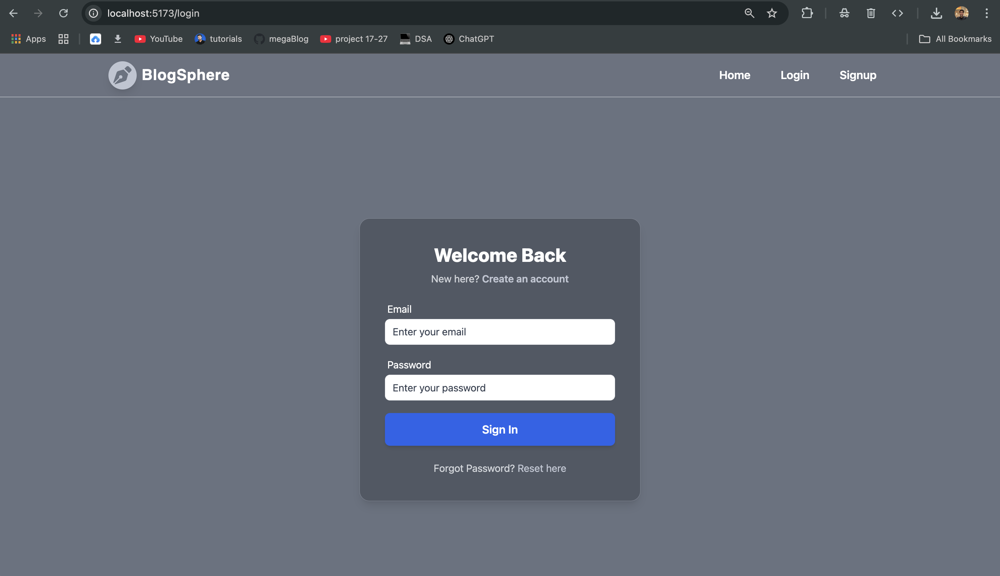
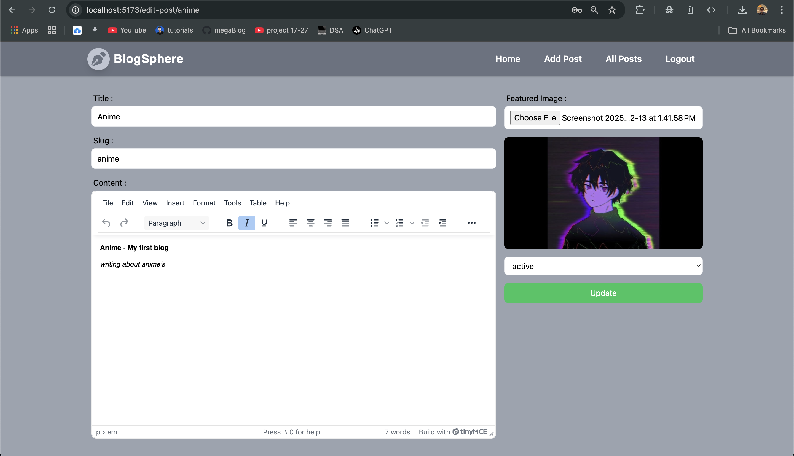
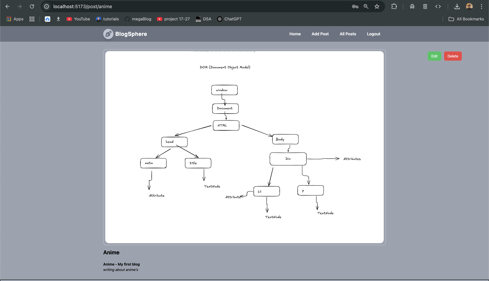

# BlogSphere
Welcome to the GitHub repository for the BlogSphere App! This repository contains the source code for a powerful blogging platform equipped with essential features like user authentication, post management, and content creation. It utilizes Appwrite as the backend service for managing the database and storage operations.

## Introduction
BlogSphere is a full-fledged blog application built with React.js that offers the following features:

- **User Management:**
  - Users can register for new accounts using a signup form with validation (powered by React Hook Form).
  - 

  - Existing users can log in securely using Appwrite for authentication.
  - 

  - Users can log out seamlessly, clearing authentication tokens.
- **Post Creation:**
  - Authorized users can create new blog posts, crafting content with ease using a rich text editor (like TinyMCE).
  - 

  - Post data is stored securely in Appwrite's database.
- **Post Listing:**
  - A clear and organized list displays all published blog posts.
  - Each post showcases the title, author, and a snippet of the content.
  - Consider implementing pagination or sorting for extensive post management (optional).
  - 
- **Update Post:**
  - Users can update their existing post if the same user that is Logged in and have their own post.
  - User can also delete their own post.
  - 

  - 

- **Route Management:**
  - The application leverages react-router-dom for efficient routing between different sections.
  - Specific routes handle authentication (login, logout), post creation, and post listing.

## Tech Stack

- **Frontend:** React.js
- **Form Handling:** React Hook Form
- **Rich Text Editor:** TinyMCE (or similar)
- **State Management:** Redux with react-redux
- **Routing:** react-router-dom
- **Backend:** Appwrite (for database, storage, and authentication)

## Deployment & Repository

- **Live Demo:** "will update soon"
- **Repository:** https://github.com/adityamawa/Blog-Sphere

## Installation

1. Clone the repository: `git clone https://github.com/adityamawa/Blog-Sphere`

2. Navigate to the project directory: `cd megablog`

3. Install dependencies: `npm install`

4. Running the Development Server : `npm run dev`

5. Access the application in your browser at `http://localhost:5173` (or the port specified in package.json).

### Appwrite Configuration

- Create an Appwrite account and project at https://appwrite.io.

- Obtain your project's endpoint URL, project ID, and API key.

- Create a `.env` file at the project root and add the following environment variables, replacing placeholders with your actual values:

  1. `VITE_APPWRITE_URL=""`
  2. `VITE_APPWRITE_PROJECT_ID=""`
  3. `VITE_APPWRITE_DATABASE_ID=""`
  4. `VITE_APPWRITE_COLLECTION_ID=""`
  5. `VITE_APPWRITE_BUCKET_ID=""`
  6. `VITE_TINY_EDITOR_API_KEY=""`

### Contributing

Contributions are welcome! If you find any issues or have suggestions for improvements, feel free to open an issue or submit a pull request.
### License
<!-- This project is licensed under the Apache License - see the [LICENSE](https://github.com/rajanjha9235/mega-blog/blob/main/LICENSE) file for details. -->

### Additional Notes

- Consider adding unit tests and end-to-end tests for robust quality assurance.
- Explore deploying the application to a production environment using a service like Vercel or Netlify.
- Refer to the official documentation for React.js, React Hook Form, TinyMCE, Redux, react-redux, react-router-dom, and Appwrite for detailed usage and configuration guidance.
- This README.md provides a general overview. For a complete understanding, delve into the source code available in the GitHub repository.

## Disclaimer

The information provided here serves as a starting point for understanding the BlogSphere app. While explanations are clear, it's recommended to explore the code itself for the most comprehensive grasp of implementation details.